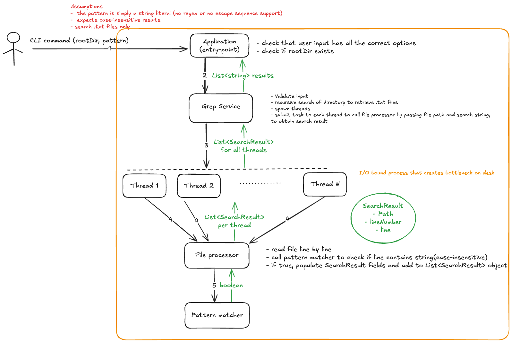

# Design Decisions

The development of this multi-threaded, recursive grep tool in Java was focused on achieving performance, scalability, and clean architecture. The application is structured around a main entry point that interacts with the user through command-line arguments and passes control to the GrepService. This service orchestrates the entire workflow by first performing a recursive search to collect all regular text files under the specified root directory. It then uses a fixed thread pool through Java's ExecutorService to distribute the files across multiple threads for parallel processing. Each thread processes its assigned files sequentially, reading them line by line and checking for matches using a lightweight pattern matching component that performs simple string comparisons. This design ensures efficient handling of I/O-bound workloads without overwhelming system resources.

The tool was built with testability and future extensibility in mind. Core components like pattern matching and file processing are separated and designed to be easily testable. The default thread pool size is set to 100, which can be adjusted depending on the environment, providing a balance between concurrency and resource control. A FixedThreadPool was chosen over a CachedThreadPool to prevent unbounded thread growth and to maintain predictable resource usage, which is especially important for I/O-bound workloads. While the current version meets the essential functional requirements, there is room for further optimization. 

## Potential Future Optimizations
- Parallelize processing within large individual files, not just across files, to better utilize multi-core systems. This can be done by implementing a new implementation of existing `FileProcessor`, can be called as `ConcurrentFileProcessor`.
- Add support for more advanced pattern matching, such as regular expressions. Again, here too, we can use the existing interface `PatternMatcher` that can re-implemented differently, ex - `RegexPatternMatcher`.
- Support additional file types or allow configurable filters to include or exclude specific file extensions
- Optionally count and display the number of pattern occurrences per line for more detailed output

These enhancements would further improve the performance, flexibility, and usability of the tool, building on its current solid and reliable foundation.